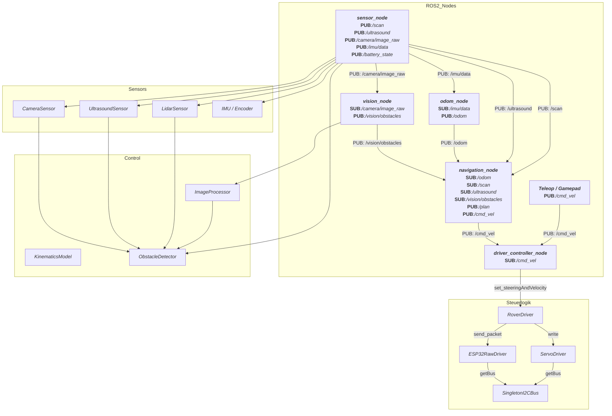

# Vereinfachtes Komponenten-Modell

```mermaid
flowchart TD

%% ROS 2 Nodes
subgraph ROS2_Nodes
    A1[<b><i>Teleop / Gamepad</i></b><br><b>PUB</b>:<i>/cmd_vel</i>]
    A2[<b><i>driver_controller_node</i></b><br><b>SUB</b>:<i>/cmd_vel</i>]
    A3[<b><i>sensor_node</i></b><br><b>PUB</b>:<i>/scan</i><br><b>PUB</b>:<i>/ultrasound</i><br><b>PUB</b>:<i>/camera/image_raw</i><br><b>PUB</b>:<i>/imu/data</i><br><b>PUB</b>:<i>/battery_state</i>]
    A4[<b><i>odom_node</i></b><br><b>SUB</b>:<i>/imu/data</i><br><b>PUB</b>:<i>/odom</i>]
    A5[<b><i>navigation_node</i></b><br><b>SUB</b>:<i>/odom</i><br><b>SUB</b>:<i>/scan</i><br><b>SUB</b>:<i>/ultrasound</i><br><b>SUB</b>:<i>/vision/obstacles</i><br><b>PUB</b>:<i>/plan</i><br><b>PUB</b>:<i>/cmd_vel</i>]
    A6[<b><i>vision_node</i></b><br><b>SUB</b>:<i>/camera/image_raw</i><br><b>PUB</b>:<i>/vision/obstacles</i>]
end

%% Steuerungstreiber
subgraph Steuerlogik
    D1[<i>RoverDriver</i>]
    D2[<i>ServoDriver</i>]
    D3[<i>ESP32RawDriver</i>]
    D4[<i>SingletonI2CBus</i>]
end

%% Sensoren
subgraph Sensors
    S1[<i>LidarSensor</i>]
    S2[<i>UltrasoundSensor</i>]
    S3[<i>CameraSensor</i>]
    S4[<i>IMU / Encoder</i>]
end

%% Fachliche Verarbeitung
subgraph Control
    C1[<i>KinematicsModel</i>]
    C2[<i>ObstacleDetector</i>]
    C3[<i>ImageProcessor</i>]
end

%% Datenflüsse ROS2
A1 -->|PUB: /cmd_vel| A2
A2 -->|set_steeringAndVelocity| D1
D1 -->|write| D2
D1 -->|send_packet| D3
D2 -->|getBus| D4
D3 -->|getBus| D4

A3 -->|PUB: /scan| A5
A3 -->|PUB: /ultrasound| A5
A3 -->|PUB: /camera/image_raw| A6
A3 -->|PUB: /imu/data| A4
A4 -->|PUB: /odom| A5
A5 -->|PUB: /cmd_vel| A2
A6 -->|PUB: /vision/obstacles| A5

%% SensorNode intern
A3 --> S1
A3 --> S2
A3 --> S3
A3 --> S4

%% Control intern
A6 --> C3
C3 --> C2
A3 --> C2
S1 --> C2
S2 --> C2
S3 --> C2

```