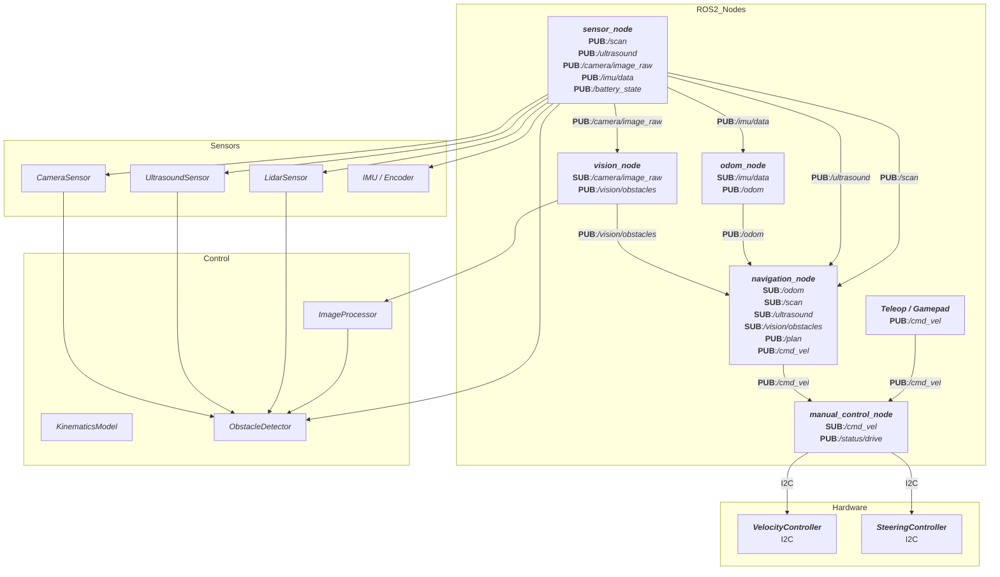

# 🧠 Rover-Klassenmodell & Architektur (ROS 2)

Dieses Dokument beschreibt das strukturierte Klassen- und Komponentensystem für einen ROS 2-basierten Allrad-Rover mit I2C-gebundener Hardwaresteuerung. Der Aufbau ist in zwei Hauptbereiche gegliedert: ROS 2 Nodes (Kommunikation, Steuerung) und fachlich-technische Klassen (Hardware, Sensorik, Verarbeitung).
# 📦 ROS 2 Launch-Datei – `rover_full.launch.py`

Diese Datei beschreibt eine vollständige ROS 2 Launch-Konfiguration für ein Rover-Projekt. Sie beinhaltet die Initialisierung von Lidar-Sensorik, TF-Frames, Gamepad-Steuerung, Odometrie, Navigation, Vision und RViz.

## 🧠 Inhalt
- Parameterladefunktion
- Dynamische Sensorinitialisierung
- Transform-Definitionen
- Gamepad- und Navigationssteuerung
- Lifecycle und RViz
- Bewertung und Erweiterungsideen

---

## 📥 Parameter laden aus YAML

```python
def load_rover_params(path: str, lidar_model:str):
    with open(path,'r') as f:
        data = yaml.safe_load(f)
        return data.get(lidar_model, {}).get("ros__parameters", {})
```

Lädt Parameter für das gewählte Lidar-Modell aus einer YAML-Datei.

---

## 🧾 Launch-Argumente

```python
lidar_model_arg = DeclareLaunchArgument(
    'lidar_model',
    default_value='ydlidar',
    description="Auswahl des Lidar-Models: ydlidar oder xv11"
)
```

Bestimmt, welches Lidar-Modell verwendet wird (`ydlidar` oder `xv11`).

...

## 🧩 Gruppenbildung & Rückgabe

```python
return LaunchDescription([
    lidar_model_arg,
    rviz_load_arg,
    params_file_arg,
    OpaqueFunction(function=create_lidar_node),
    core_nodes,
    nav_vision_nodes,
    OpaqueFunction(function=create_nodes_from_arguments)
])
```

Startet alle definieren Nodes und Gruppen abhängig von Startargumenten.

---

## ✅ Bewertung

| Kategorie            | Einschätzung                         |
| -------------------- | ------------------------------------ |
| Modularität          | ✅ Sehr gut durch Gruppen und Wrapper |
| Erweiterbarkeit      | ✅ Unterstützt mehrere Sensoren       |
| Lesbarkeit           | ✅ Klar strukturiert, gut benannt     |
| Wiederverwendbarkeit | ✅ YAML-basierte Konfiguration        |

---

## 💡 Verbesserungsvorschläge

- Lifecycle Manager für `odom_node` aktivieren
- URDF mit `robot_state_publisher` laden
- `use_sim_time`-Schalter ergänzen
- Logging in Datei ergänzen
- Optionale Namespace-Unterstützung einbauen
- `robot_localization` für Odom+IMU/GPS

---

📘 Diese Launch-Datei bildet eine solide Grundlage für ein ROS 2-basiertes Rover-System.

## 📘 Inhaltsverzeichnis

- [🧠 Rover-Klassenmodell \& Architektur (ROS 2)](#-rover-klassenmodell--architektur-ros-2)
- [📦 ROS 2 Launch-Datei – `rover_full.launch.py`](#-ros-2-launch-datei--rover_fulllaunchpy)
  - [🧠 Inhalt](#-inhalt)
  - [📥 Parameter laden aus YAML](#-parameter-laden-aus-yaml)
  - [🧾 Launch-Argumente](#-launch-argumente)
  - [🧩 Gruppenbildung \& Rückgabe](#-gruppenbildung--rückgabe)
  - [✅ Bewertung](#-bewertung)
  - [💡 Verbesserungsvorschläge](#-verbesserungsvorschläge)
  - [📘 Inhaltsverzeichnis](#-inhaltsverzeichnis)
- [🏗️ Architekturmodell Rover-Projekt (ROS 2) – 3-Schichten-Modell](#️-architekturmodell-rover-projekt-ros-2--3-schichten-modell)
  - [1. Node-Schicht (ROS 2 Communication Layer)](#1-node-schicht-ros-2-communication-layer)
    - [Aufgaben:](#aufgaben)
    - [Beispiele:](#beispiele)
  - [2. Control-Schicht (Logik / Steuerung / Verarbeitung)](#2-control-schicht-logik--steuerung--verarbeitung)
    - [Aufgaben:](#aufgaben-1)
    - [Beispiele:](#beispiele-1)
  - [3. Hardware-Schicht (Treiber / I2C Kommunikation)](#3-hardware-schicht-treiber--i2c-kommunikation)
    - [Aufgaben:](#aufgaben-2)
    - [Beispiele:](#beispiele-2)
  - [Visualisierung](#visualisierung)
  - [Vorteile dieser Architektur](#vorteile-dieser-architektur)
- [🧩 Komponentendiagramm](#-komponentendiagramm)
  - [Legende:](#legende)
- [🧩 ROS2 Node - 1. Schicht (ROS-spezifisch, verwenden `rclpy`)](#-ros2-node---1-schicht-ros-spezifisch-verwenden-rclpy)
  - [`SensorNode` (Lidar / Ultraschall / Kamera)](#sensornode-lidar--ultraschall--kamera)
    - [veröffentlicht Topic (Publisher)](#veröffentlicht-topic-publisher)
    - [abonniert Topic (Subscriber)](#abonniert-topic-subscriber)
  - [OdomNode](#odomnode)
    - [veröffentlicht Topic (Publisher)](#veröffentlicht-topic-publisher-1)
    - [abonniert Topic (Subscriber)](#abonniert-topic-subscriber-1)
  - [ManualControlNode (DriveControllerNode)](#manualcontrolnode-drivecontrollernode)
    - [veröffentlicht Topic (Publisher)](#veröffentlicht-topic-publisher-2)
    - [abonniert Topic (Subscriber)](#abonniert-topic-subscriber-2)
  - [NavigationNode](#navigationnode)
    - [veröffentlicht Topic (Publisher)](#veröffentlicht-topic-publisher-3)
    - [abonniert Topic (Subscriber)](#abonniert-topic-subscriber-3)
  - [VisionNode (zukünftig)](#visionnode-zukünftig)
    - [veröffentlicht Topic (Publisher)](#veröffentlicht-topic-publisher-4)
    - [abonniert Topic (Subscriber)](#abonniert-topic-subscriber-4)
- [Controller-Schicht (2. Schicht)](#controller-schicht-2-schicht)
    - [MotorDriver](#motordriver)
    - [SteeringController](#steeringcontroller)
    - [KinematicsModel](#kinematicsmodel)
    - [SensorInterface](#sensorinterface)
    - [LidarSensor, UltrasoundSensor, CameraSensor](#lidarsensor-ultrasoundsensor-camerasensor)
    - [`ImageProcessor` (zukünftig)](#imageprocessor-zukünftig)
    - [`ObstacleDetector`](#obstacledetector)
  - [Hardwareschicht (HAL) - 3. Schicht](#hardwareschicht-hal---3-schicht)
    - [Hardwarenahe Klassen](#hardwarenahe-klassen)
- [📦 Klassenmodell](#-klassenmodell)
- [📎 Hinweise zur Erweiterbarkeit](#-hinweise-zur-erweiterbarkeit)


---


# 🏗️ Architekturmodell Rover-Projekt (ROS 2) – 3-Schichten-Modell

Dieses Dokument beschreibt die geplante Software-Architektur für dein ROS 2 Rover-Projekt.
Das Modell orientiert sich an einer klaren Schichtenarchitektur mit Trennung von Kommunikation, Fachlogik und Hardwarezugriff.

---

## 1. Node-Schicht (ROS 2 Communication Layer)

### Aufgaben:
- Implementierung aller ROS 2 Nodes
- Verarbeiten und Weiterreichen von ROS-Messages (Publisher, Subscriber, Actions, Services)
- Kein direkter Hardwarezugriff!
- Abhängig von `rclpy`, ROS-Interfaces und Topics

### Beispiele:

| Node                  | Aufgabe                                             | Typ                 |
| --------------------- | --------------------------------------------------- | ------------------- |
| `manual_control_node` | Empfängt `/cmd_vel` und delegiert an Controller     | Subscriber          |
| `sensor_node`         | Publiziert Sensordaten (LiDAR, Ultraschall, Kamera) | Publisher           |
| `odom_node`           | Berechnet und publiziert Odometrie                  | Publisher           |
| `navigation_node`     | Verwaltet SLAM, Navigation und Pathfinding          | Action-Client       |
| `vision_node`         | Führt Bildverarbeitung aus                          | Publisher / Service |

---

## 2. Control-Schicht (Logik / Steuerung / Verarbeitung)

### Aufgaben:
- Fachlogik: Berechnungen, Steuerstrategien
- Hardware-unabhängig
- Transformation von Steuerwerten in Zielgrößen für Aktoren
- Implementierung von Kinematik, Odometrie, Bildverarbeitung

### Beispiele:

| Klasse             | Aufgabe                                         |
| ------------------ | ----------------------------------------------- |
| `KinematicsModel`  | Umrechnung Twist <-> Radgeschwindigkeiten       |
| `ObstacleDetector` | Fusion von Sensorwerten zu Hindernisinformation |
| `ImageProcessor`   | Bildverarbeitung (z.B. Objekterkennung)         |

---

## 3. Hardware-Schicht (Treiber / I2C Kommunikation)

### Aufgaben:
- Abstraktion und Zugriff auf Hardware über definierte Schnittstellen
- Nutzung von I2C, UART, SPI oder direkter Bibliotheken
- Versenden fertiger Steuerwerte an Motorcontroller, Servos, Sensoren

### Beispiele:

| Klasse               | Aufgabe                                    |
| -------------------- | ------------------------------------------ |
| `ServoDriver`        | Gemeinsame I2C-Basisklasse                 |
| `VelocityController` | Steuerung der Antriebseinheiten (via I2C)  |
| `SteeringController` | Steuerung der Lenkservos (via I2C)         |
| `LidarSensor`        | Rohdatenempfang und Verarbeitung vom LiDAR |
| `UltrasoundSensor`   | Triggern und Messen per Ultraschall        |

---

## Visualisierung

```text
+---------------------------+
|      ROS 2 Node-Schicht   |  <-- rclpy, ROS2 Messages
+---------------------------+
| Control-Schicht           |  <-- Fachlogik, Verarbeitung
+---------------------------+
| Hardware-Schicht          |  <-- I2C / Treiber / Sensor-Access
+---------------------------+
```

---

## Vorteile dieser Architektur

| Vorteil                           | Nutzen                                                       |
| --------------------------------- | ------------------------------------------------------------ |
| Trennung von ROS 2 Abhängigkeiten | Austauschbar, testbar, isoliert                              |
| Klare Verantwortlichkeiten        | Nodes = Kommunikation / Control = Logik / Hardware = Zugriff |
| Zukünftig erweiterbar             | Sensoren, Motoren, weitere Aktoren einfach ergänzbar         |
| Perfekt für Unit-Tests            | Control- und Hardwareklassen einzeln testbar                 |

---

Erstellt für das Allrad-gelenkte ROS 2 Rover-Projekt mit modularer Schichtenarchitektur.


# 🧩 Komponentendiagramm




## Legende:
- ROS2 Nodes = Kommunikationsebene
- Hardware = I2C Controller
- Sensors = Physische Sensoren
- Control = Fachlogik & Verarbeitung
- Topics = ROS 2 Kommunikation (Publisher / Subscriber)
- I2C = Steuerung Richtung ESP32 (Velocity / Steering)
- PUB = published Topic
- SUB = subscribe Topic
---


# 🧩 ROS2 Node - 1. Schicht (ROS-spezifisch, verwenden `rclpy`)

## `SensorNode` (Lidar / Ultraschall / Kamera)
- **Verantwortungsbereich**
  - Zentrale Erfassung aller Sensordaten des Rovers.
  - Initialisiert und betreibt alle physischen Sensoren.
  - Publiziert Rohdaten in ROS Topics.
  
### veröffentlicht Topic (Publisher)

| Topic               | Msg Type                   | Beschreibung          |
| ------------------- | -------------------------- | --------------------- |
| `/scan`             | `sensor_msgs/LaserScan`    | LiDAR Scan-Daten      |
| `/ultrasound`       | `sensor_msgs/Range`        | Ultraschall Messwerte |
| `/camera/image_raw` | `sensor_msgs/Image`        | Kamerabild            |
| `/imu/data`         | `sensor_msgs/Imu`          | IMU Bewegungsdaten    |
| `/battery_state`    | `sensor_msgs/BatteryState` | Akkustatus            |

### abonniert Topic (Subscriber)

| Topic | Msg Type | Beschreibung                              |
| ----- | -------- | ----------------------------------------- |
| —     | —        | SensorNode empfängt keine externen Topics |

---

## OdomNode
- **Verantwortung**: 
  - Berechnet und veröffentlicht die Odometrie des Roboters.
  - Nutzt Encoderwerte und evtl. IMU-Daten zur Positionsbestimmung.
  - Dient als Basis für die Navigation.

### veröffentlicht Topic (Publisher)

| Topic   | Msg Type            | Beschreibung         |
| ------- | ------------------- | -------------------- |
| `/odom` | `nav_msgs/Odometry` | Berechnete Odometrie |

### abonniert Topic (Subscriber)

| Topic                  | Msg Type               | Beschreibung              |
| ---------------------- | ---------------------- | ------------------------- |
| `/imu/data`            | `sensor_msgs/Imu`      | IMU Daten für Odometrie   |
| Encoder Daten über I2C | intern oder Custom Msg | Motor-Daten zur Odometrie |

---

## ManualControlNode (DriveControllerNode)
- **Verantwortung**: 
  - Entgegennahme von Fahrbefehlen (`/cmd_vel`).
  - Umsetzung von Geschwindigkeit und Lenkkrümmung.
  - Ansteuerung des MotorDriver und SteeringController via I2C.

### veröffentlicht Topic (Publisher)

| Topic           | Msg Type               | Beschreibung         |
| --------------- | ---------------------- | -------------------- |
| `/status/drive` | Custom oder `std_msgs` | Aktueller Fahrstatus |

### abonniert Topic (Subscriber)

| Topic      | Msg Type              | Beschreibung                     |
| ---------- | --------------------- | -------------------------------- |
| `/cmd_vel` | `geometry_msgs/Twist` | Fahrbefehle vom Gamepad / Teleop |


---

## NavigationNode
- **Verantwortung**: 
  - Globale Pfadplanung und Navigation zum Ziel.
  - Lokale Kollisionsvermeidung.
  - Nutzung von SLAM und Kartendaten.
- 
### veröffentlicht Topic (Publisher)

| Topic      | Msg Type              | Beschreibung                                       |
| ---------- | --------------------- | -------------------------------------------------- |
| `/plan`    | `nav_msgs/Path`       | Geplanter Pfad                                     |
| `/cmd_vel` | `geometry_msgs/Twist` | Generierte Bewegungsbefehle an DriveControllerNode |

### abonniert Topic (Subscriber)

| Topic               | Msg Type                | Beschreibung                     |
| ------------------- | ----------------------- | -------------------------------- |
| `/odom`             | `nav_msgs/Odometry`     | Odometrie-Daten                  |
| `/scan`             | `sensor_msgs/LaserScan` | LiDAR-Umgebungsdaten             |
| `/ultrasound`       | `sensor_msgs/Range`     | Zusatz Hindernisinformationen    |
| `/vision/obstacles` | Custom Msg              | Hindernisse aus Bildverarbeitung |


## VisionNode (zukünftig)
- **Verantwortung**: 
  - Bildverarbeitung zur Objekterkennung und Hindernisvermeidung.
  - Fusion von Bilddaten mit anderen Sensorquellen.
  - Publikation erkannter Hindernisse.
  
### veröffentlicht Topic (Publisher)

| Topic               | Msg Type   | Beschreibung                                        |
| ------------------- | ---------- | --------------------------------------------------- |
| `/vision/obstacles` | Custom Msg | Hindernisse / erkannte Objekte aus Bildverarbeitung |

### abonniert Topic (Subscriber)

| Topic               | Msg Type            | Beschreibung        |
| ------------------- | ------------------- | ------------------- |
| `/camera/image_raw` | `sensor_msgs/Image` | Rohdaten der Kamera |


# Controller-Schicht (2. Schicht)

### MotorDriver
- Hardwaresteuerung, z. B. I2C/UART-Kommunikation mit Motorcontroller

### SteeringController
- Umrechnung von Krümmung in Servo-RAW-Werte
- Unterstützt Allradlenkung (inkl. max/min Winkel etc.)

### KinematicsModel
- Berechnung der Fahrkinematik
- Umkehrkinematik für Odometrie

### SensorInterface
- Abstrakte Basisklasse für Sensoren (Lidar, Ultraschall, Kamera)

### LidarSensor, UltrasoundSensor, CameraSensor
- Spezifische Implementierungen
- Parsen von Rohdaten, ggf. Filterung

### `ImageProcessor` (zukünftig)
- Führt Bildverarbeitung durch, z. B.:
  - Objekterkennung (ML)
  - Linienverfolgung
  - Kantenerkennung

### `ObstacleDetector`
- Fusioniert Sensordaten von LiDAR, Kamera und Ultraschall
- Erkennt Hindernisse und gibt Zonen oder Objektlisten aus

---

## Hardwareschicht (HAL) - 3. Schicht

### Hardwarenahe Klassen
- `ServoDriver`: Basisklasse für alle I2C-basierten Hardwaremodule
- `VelocityController`: Ableitung von `ServoDriver`, für Antrieb
- `SteeringController`: Ableitung von `ServoDriver`, für Lenkung
- Diese Klassen verwenden JSON über I2C zur Kommunikation mit dem ESP32

---

# 📦 Klassenmodell
<tbd>

```

```
---


# 📎 Hinweise zur Erweiterbarkeit

- Die Architektur erlaubt einfache Erweiterung durch neue Sensoren oder Steuerkomponenten.
- Neue Nodes (z. B. Missionssteuerung, Autonomes Fahren) können nahtlos integriert werden.
- Eine Trennung von ROS-spezifischem Code und technischer Steuerlogik erhöht die Testbarkeit und Wartbarkeit.

---

Erstellt für das Projekt eines Allrad-gelenkten ROS 2 Rovers mit modularer Hardwarearchitektur.
