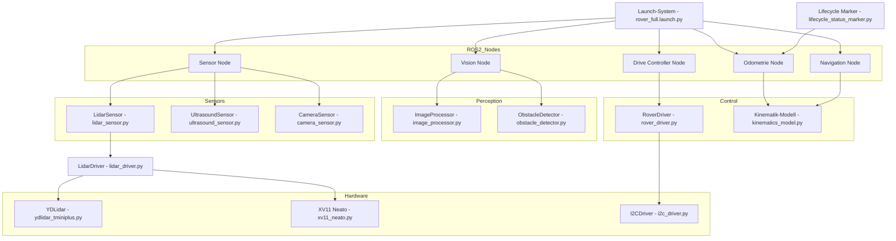

# __init__.py

## 📝 Funktion
Init-Datei für das entsprechende Python-Paket.

## 🔍 Struktur
Enthält keine explizit definierte Klasse oder Funktion auf oberster Ebene.

## 💡 Erweiterungsvorschläge
- [ ] Prüfen, ob Docstrings vorhanden sind und ergänzt werden können.
- [ ] Unit Tests für kritische Logik ergänzen.
- [ ] Logging (statt print) zur besseren Diagnose verwenden.
- [ ] Typannotationen und Exceptions verbessern, falls noch nicht vorhanden.

# control/__init__.py

## 📝 Funktion
Dieses Modul behandelt die Steuerungs- und Regelungslogik (z. B. Kinematik).

## 🔍 Struktur
Enthält keine explizit definierte Klasse oder Funktion auf oberster Ebene.

## 💡 Erweiterungsvorschläge
- [ ] Prüfen, ob Docstrings vorhanden sind und ergänzt werden können.
- [ ] Unit Tests für kritische Logik ergänzen.
- [ ] Logging (statt print) zur besseren Diagnose verwenden.
- [ ] Typannotationen und Exceptions verbessern, falls noch nicht vorhanden.

# control/kinematics_model.py

## 📝 Funktion
Dieses Modul behandelt die Steuerungs- und Regelungslogik (z. B. Kinematik).

## 🔍 Struktur
- Klassen: KinematicsModel

## 💡 Erweiterungsvorschläge
- [ ] Prüfen, ob Docstrings vorhanden sind und ergänzt werden können.
- [ ] Unit Tests für kritische Logik ergänzen.
- [ ] Logging (statt print) zur besseren Diagnose verwenden.
- [ ] Typannotationen und Exceptions verbessern, falls noch nicht vorhanden.

# driver_controller_node.py

## 📝 Funktion
Dieses Python-Modul ist ein ROS2-Node und wird direkt über die Launch-Datei gestartet.

## 🔍 Struktur
- Klassen: BUTTONS, JOYSTICKS, DriverControllerNode
- Funktionen: main

## 💡 Erweiterungsvorschläge
- [ ] Prüfen, ob Docstrings vorhanden sind und ergänzt werden können.
- [ ] Unit Tests für kritische Logik ergänzen.
- [ ] Logging (statt print) zur besseren Diagnose verwenden.
- [ ] Typannotationen und Exceptions verbessern, falls noch nicht vorhanden.

# hardware/__init__.py

## 📝 Funktion
Init-Datei für das entsprechende Python-Paket.

## 🔍 Struktur
Enthält keine explizit definierte Klasse oder Funktion auf oberster Ebene.

## 💡 Erweiterungsvorschläge
- [ ] Prüfen, ob Docstrings vorhanden sind und ergänzt werden können.
- [ ] Unit Tests für kritische Logik ergänzen.
- [ ] Logging (statt print) zur besseren Diagnose verwenden.
- [ ] Typannotationen und Exceptions verbessern, falls noch nicht vorhanden.

# hardware/i2c_driver.py

## 📝 Funktion
Dieses Modul enthält Treiberfunktionen für die Hardware des Rovers.

## 🔍 Struktur
- Klassen: CommandID, SubCommandID, DIGITALPINS, I2CTest, SingletonI2CBus, ESP32RawDriver, ServoDriver
- Funktionen: isValidPinState, dataModulo, send_packet, CRC8

## 💡 Erweiterungsvorschläge
- [ ] Prüfen, ob Docstrings vorhanden sind und ergänzt werden können.
- [ ] Unit Tests für kritische Logik ergänzen.
- [ ] Logging (statt print) zur besseren Diagnose verwenden.
- [ ] Typannotationen und Exceptions verbessern, falls noch nicht vorhanden.

# hardware/lidar_driver.py

## 📝 Funktion
Dieses Modul enthält Treiberfunktionen für die Hardware des Rovers.

## 🔍 Struktur
- Klassen: LidarDriver

## 💡 Erweiterungsvorschläge
- [ ] Prüfen, ob Docstrings vorhanden sind und ergänzt werden können.
- [ ] Unit Tests für kritische Logik ergänzen.
- [ ] Logging (statt print) zur besseren Diagnose verwenden.
- [ ] Typannotationen und Exceptions verbessern, falls noch nicht vorhanden.

# hardware/rover_driver.py

## 📝 Funktion
Dieses Modul enthält Treiberfunktionen für die Hardware des Rovers.

## 🔍 Struktur
- Klassen: RoverDriver

## 💡 Erweiterungsvorschläge
- [ ] Prüfen, ob Docstrings vorhanden sind und ergänzt werden können.
- [ ] Unit Tests für kritische Logik ergänzen.
- [ ] Logging (statt print) zur besseren Diagnose verwenden.
- [ ] Typannotationen und Exceptions verbessern, falls noch nicht vorhanden.

# hardware/xv11_neato.py

## 📝 Funktion
Allgemeines Hilfs- oder Steuerungsmodul im Rover-Projekt.

## 🔍 Struktur
- Klassen: XV11Lidar

## 💡 Erweiterungsvorschläge
- [ ] Prüfen, ob Docstrings vorhanden sind und ergänzt werden können.
- [ ] Unit Tests für kritische Logik ergänzen.
- [ ] Logging (statt print) zur besseren Diagnose verwenden.
- [ ] Typannotationen und Exceptions verbessern, falls noch nicht vorhanden.

# hardware/ydlidar_tminiplus.py

## 📝 Funktion
Allgemeines Hilfs- oder Steuerungsmodul im Rover-Projekt.

## 🔍 Struktur
- Klassen: YDLidarTFMini

## 💡 Erweiterungsvorschläge
- [ ] Prüfen, ob Docstrings vorhanden sind und ergänzt werden können.
- [ ] Unit Tests für kritische Logik ergänzen.
- [ ] Logging (statt print) zur besseren Diagnose verwenden.
- [ ] Typannotationen und Exceptions verbessern, falls noch nicht vorhanden.

# navigation_node.py

## 📝 Funktion
Dieses Python-Modul ist ein ROS2-Node und wird direkt über die Launch-Datei gestartet.

## 🔍 Struktur
- Klassen: NavigationNode
- Funktionen: main

## 💡 Erweiterungsvorschläge
- [ ] Prüfen, ob Docstrings vorhanden sind und ergänzt werden können.
- [ ] Unit Tests für kritische Logik ergänzen.
- [ ] Logging (statt print) zur besseren Diagnose verwenden.
- [ ] Typannotationen und Exceptions verbessern, falls noch nicht vorhanden.

# odom_node.py

## 📝 Funktion
Dieses Python-Modul ist ein ROS2-Node und wird direkt über die Launch-Datei gestartet.

## 🔍 Struktur
- Klassen: OdomNode
- Funktionen: main

## 💡 Erweiterungsvorschläge
- [ ] Prüfen, ob Docstrings vorhanden sind und ergänzt werden können.
- [ ] Unit Tests für kritische Logik ergänzen.
- [ ] Logging (statt print) zur besseren Diagnose verwenden.
- [ ] Typannotationen und Exceptions verbessern, falls noch nicht vorhanden.

# perception/__init__.py

## 📝 Funktion
Dieses Modul verarbeitet Kamerabilder oder Laserdaten zur Umgebungswahrnehmung.

## 🔍 Struktur
Enthält keine explizit definierte Klasse oder Funktion auf oberster Ebene.

## 💡 Erweiterungsvorschläge
- [ ] Prüfen, ob Docstrings vorhanden sind und ergänzt werden können.
- [ ] Unit Tests für kritische Logik ergänzen.
- [ ] Logging (statt print) zur besseren Diagnose verwenden.
- [ ] Typannotationen und Exceptions verbessern, falls noch nicht vorhanden.

# perception/image_processor.py

## 📝 Funktion
Dieses Modul verarbeitet Kamerabilder oder Laserdaten zur Umgebungswahrnehmung.

## 🔍 Struktur
- Klassen: ImageProcessor

## 💡 Erweiterungsvorschläge
- [ ] Prüfen, ob Docstrings vorhanden sind und ergänzt werden können.
- [ ] Unit Tests für kritische Logik ergänzen.
- [ ] Logging (statt print) zur besseren Diagnose verwenden.
- [ ] Typannotationen und Exceptions verbessern, falls noch nicht vorhanden.

# perception/obstacle_detector.py

## 📝 Funktion
Dieses Modul verarbeitet Kamerabilder oder Laserdaten zur Umgebungswahrnehmung.

## 🔍 Struktur
- Klassen: ObstacleDetector

## 💡 Erweiterungsvorschläge
- [ ] Prüfen, ob Docstrings vorhanden sind und ergänzt werden können.
- [ ] Unit Tests für kritische Logik ergänzen.
- [ ] Logging (statt print) zur besseren Diagnose verwenden.
- [ ] Typannotationen und Exceptions verbessern, falls noch nicht vorhanden.

# sensor_node.py

## 📝 Funktion
Dieses Python-Modul ist ein ROS2-Node und wird direkt über die Launch-Datei gestartet.

## 🔍 Struktur
- Klassen: SensorNode
- Funktionen: main

## 💡 Erweiterungsvorschläge
- [ ] Prüfen, ob Docstrings vorhanden sind und ergänzt werden können.
- [ ] Unit Tests für kritische Logik ergänzen.
- [ ] Logging (statt print) zur besseren Diagnose verwenden.
- [ ] Typannotationen und Exceptions verbessern, falls noch nicht vorhanden.

# sensors/__init__.py

## 📝 Funktion
Dieses Modul definiert ein oder mehrere Sensorschnittstellen für den Rover.

## 🔍 Struktur
Enthält keine explizit definierte Klasse oder Funktion auf oberster Ebene.

## 💡 Erweiterungsvorschläge
- [ ] Prüfen, ob Docstrings vorhanden sind und ergänzt werden können.
- [ ] Unit Tests für kritische Logik ergänzen.
- [ ] Logging (statt print) zur besseren Diagnose verwenden.
- [ ] Typannotationen und Exceptions verbessern, falls noch nicht vorhanden.

# sensors/camera_sensor.py

## 📝 Funktion
Dieses Modul definiert ein oder mehrere Sensorschnittstellen für den Rover.

## 🔍 Struktur
- Klassen: CameraSensor

## 💡 Erweiterungsvorschläge
- [ ] Prüfen, ob Docstrings vorhanden sind und ergänzt werden können.
- [ ] Unit Tests für kritische Logik ergänzen.
- [ ] Logging (statt print) zur besseren Diagnose verwenden.
- [ ] Typannotationen und Exceptions verbessern, falls noch nicht vorhanden.

# sensors/lidar_sensor.py

## 📝 Funktion
Dieses Modul definiert ein oder mehrere Sensorschnittstellen für den Rover.

## 🔍 Struktur
- Klassen: LidarSensor

## 💡 Erweiterungsvorschläge
- [ ] Prüfen, ob Docstrings vorhanden sind und ergänzt werden können.
- [ ] Unit Tests für kritische Logik ergänzen.
- [ ] Logging (statt print) zur besseren Diagnose verwenden.
- [ ] Typannotationen und Exceptions verbessern, falls noch nicht vorhanden.

# sensors/sensor_interface.py

## 📝 Funktion
Dieses Modul definiert ein oder mehrere Sensorschnittstellen für den Rover.

## 🔍 Struktur
- Klassen: SensorInterface

## 💡 Erweiterungsvorschläge
- [ ] Prüfen, ob Docstrings vorhanden sind und ergänzt werden können.
- [ ] Unit Tests für kritische Logik ergänzen.
- [ ] Logging (statt print) zur besseren Diagnose verwenden.
- [ ] Typannotationen und Exceptions verbessern, falls noch nicht vorhanden.

# sensors/ultrasound_sensor.py

## 📝 Funktion
Dieses Modul definiert ein oder mehrere Sensorschnittstellen für den Rover.

## 🔍 Struktur
- Klassen: UltrasoundSensor

## 💡 Erweiterungsvorschläge
- [ ] Prüfen, ob Docstrings vorhanden sind und ergänzt werden können.
- [ ] Unit Tests für kritische Logik ergänzen.
- [ ] Logging (statt print) zur besseren Diagnose verwenden.
- [ ] Typannotationen und Exceptions verbessern, falls noch nicht vorhanden.

# vision_node.py

## 📝 Funktion
Dieses Python-Modul ist ein ROS2-Node und wird direkt über die Launch-Datei gestartet.

## 🔍 Struktur
- Klassen: VisionNode
- Funktionen: main

## 💡 Erweiterungsvorschläge
- [ ] Prüfen, ob Docstrings vorhanden sind und ergänzt werden können.
- [ ] Unit Tests für kritische Logik ergänzen.
- [ ] Logging (statt print) zur besseren Diagnose verwenden.
- [ ] Typannotationen und Exceptions verbessern, falls noch nicht vorhanden.

# __init__.py

## 📝 Funktion
Init-Datei für das entsprechende Python-Paket.

## 🔍 Struktur
Enthält keine explizit definierte Klasse oder Funktion auf oberster Ebene.

## 💡 Erweiterungsvorschläge
- [ ] Prüfen, ob Docstrings vorhanden sind und ergänzt werden können.
- [ ] Unit Tests für kritische Logik ergänzen.
- [ ] Logging (statt print) zur besseren Diagnose verwenden.
- [ ] Typannotationen und Exceptions verbessern, falls noch nicht vorhanden.

# control/__init__.py

## 📝 Funktion
Dieses Modul behandelt die Steuerungs- und Regelungslogik (z. B. Kinematik).

## 🔍 Struktur
Enthält keine explizit definierte Klasse oder Funktion auf oberster Ebene.

## 💡 Erweiterungsvorschläge
- [ ] Prüfen, ob Docstrings vorhanden sind und ergänzt werden können.
- [ ] Unit Tests für kritische Logik ergänzen.
- [ ] Logging (statt print) zur besseren Diagnose verwenden.
- [ ] Typannotationen und Exceptions verbessern, falls noch nicht vorhanden.

# control/kinematics_model.py

## 📝 Funktion
Dieses Modul behandelt die Steuerungs- und Regelungslogik (z. B. Kinematik).

## 🔍 Struktur
- Klassen: KinematicsModel

## 💡 Erweiterungsvorschläge
- [ ] Prüfen, ob Docstrings vorhanden sind und ergänzt werden können.
- [ ] Unit Tests für kritische Logik ergänzen.
- [ ] Logging (statt print) zur besseren Diagnose verwenden.
- [ ] Typannotationen und Exceptions verbessern, falls noch nicht vorhanden.

# driver_controller_node.py

## 📝 Funktion
Dieses Python-Modul ist ein ROS2-Node und wird direkt über die Launch-Datei gestartet.

## 🔍 Struktur
- Klassen: BUTTONS, JOYSTICKS, DriverControllerNode
- Funktionen: main

## 💡 Erweiterungsvorschläge
- [ ] Prüfen, ob Docstrings vorhanden sind und ergänzt werden können.
- [ ] Unit Tests für kritische Logik ergänzen.
- [ ] Logging (statt print) zur besseren Diagnose verwenden.
- [ ] Typannotationen und Exceptions verbessern, falls noch nicht vorhanden.

# hardware/__init__.py

## 📝 Funktion
Init-Datei für das entsprechende Python-Paket.

## 🔍 Struktur
Enthält keine explizit definierte Klasse oder Funktion auf oberster Ebene.

## 💡 Erweiterungsvorschläge
- [ ] Prüfen, ob Docstrings vorhanden sind und ergänzt werden können.
- [ ] Unit Tests für kritische Logik ergänzen.
- [ ] Logging (statt print) zur besseren Diagnose verwenden.
- [ ] Typannotationen und Exceptions verbessern, falls noch nicht vorhanden.

# hardware/i2c_driver.py

## 📝 Funktion
Dieses Modul enthält Treiberfunktionen für die Hardware des Rovers.

## 🔍 Struktur
- Klassen: CommandID, SubCommandID, DIGITALPINS, I2CTest, SingletonI2CBus, ESP32RawDriver, ServoDriver
- Funktionen: isValidPinState, dataModulo, send_packet, CRC8

## 💡 Erweiterungsvorschläge
- [ ] Prüfen, ob Docstrings vorhanden sind und ergänzt werden können.
- [ ] Unit Tests für kritische Logik ergänzen.
- [ ] Logging (statt print) zur besseren Diagnose verwenden.
- [ ] Typannotationen und Exceptions verbessern, falls noch nicht vorhanden.

# hardware/lidar_driver.py

## 📝 Funktion
Dieses Modul enthält Treiberfunktionen für die Hardware des Rovers.

## 🔍 Struktur
- Klassen: LidarDriver

## 💡 Erweiterungsvorschläge
- [ ] Prüfen, ob Docstrings vorhanden sind und ergänzt werden können.
- [ ] Unit Tests für kritische Logik ergänzen.
- [ ] Logging (statt print) zur besseren Diagnose verwenden.
- [ ] Typannotationen und Exceptions verbessern, falls noch nicht vorhanden.

# hardware/rover_driver.py

## 📝 Funktion
Dieses Modul enthält Treiberfunktionen für die Hardware des Rovers.

## 🔍 Struktur
- Klassen: RoverDriver

## 💡 Erweiterungsvorschläge
- [ ] Prüfen, ob Docstrings vorhanden sind und ergänzt werden können.
- [ ] Unit Tests für kritische Logik ergänzen.
- [ ] Logging (statt print) zur besseren Diagnose verwenden.
- [ ] Typannotationen und Exceptions verbessern, falls noch nicht vorhanden.

# hardware/xv11_neato.py

## 📝 Funktion
Allgemeines Hilfs- oder Steuerungsmodul im Rover-Projekt.

## 🔍 Struktur
- Klassen: XV11Lidar

## 💡 Erweiterungsvorschläge
- [ ] Prüfen, ob Docstrings vorhanden sind und ergänzt werden können.
- [ ] Unit Tests für kritische Logik ergänzen.
- [ ] Logging (statt print) zur besseren Diagnose verwenden.
- [ ] Typannotationen und Exceptions verbessern, falls noch nicht vorhanden.

# hardware/ydlidar_tminiplus.py

## 📝 Funktion
Allgemeines Hilfs- oder Steuerungsmodul im Rover-Projekt.

## 🔍 Struktur
- Klassen: YDLidarTFMini

## 💡 Erweiterungsvorschläge
- [ ] Prüfen, ob Docstrings vorhanden sind und ergänzt werden können.
- [ ] Unit Tests für kritische Logik ergänzen.
- [ ] Logging (statt print) zur besseren Diagnose verwenden.
- [ ] Typannotationen und Exceptions verbessern, falls noch nicht vorhanden.

# navigation_node.py

## 📝 Funktion
Dieses Python-Modul ist ein ROS2-Node und wird direkt über die Launch-Datei gestartet.

## 🔍 Struktur
- Klassen: NavigationNode
- Funktionen: main

## 💡 Erweiterungsvorschläge
- [ ] Prüfen, ob Docstrings vorhanden sind und ergänzt werden können.
- [ ] Unit Tests für kritische Logik ergänzen.
- [ ] Logging (statt print) zur besseren Diagnose verwenden.
- [ ] Typannotationen und Exceptions verbessern, falls noch nicht vorhanden.

# odom_node.py

## 📝 Funktion
Dieses Python-Modul ist ein ROS2-Node und wird direkt über die Launch-Datei gestartet.

## 🔍 Struktur
- Klassen: OdomNode
- Funktionen: main

## 💡 Erweiterungsvorschläge
- [ ] Prüfen, ob Docstrings vorhanden sind und ergänzt werden können.
- [ ] Unit Tests für kritische Logik ergänzen.
- [ ] Logging (statt print) zur besseren Diagnose verwenden.
- [ ] Typannotationen und Exceptions verbessern, falls noch nicht vorhanden.

# perception/__init__.py

## 📝 Funktion
Dieses Modul verarbeitet Kamerabilder oder Laserdaten zur Umgebungswahrnehmung.

## 🔍 Struktur
Enthält keine explizit definierte Klasse oder Funktion auf oberster Ebene.

## 💡 Erweiterungsvorschläge
- [ ] Prüfen, ob Docstrings vorhanden sind und ergänzt werden können.
- [ ] Unit Tests für kritische Logik ergänzen.
- [ ] Logging (statt print) zur besseren Diagnose verwenden.
- [ ] Typannotationen und Exceptions verbessern, falls noch nicht vorhanden.

# perception/image_processor.py

## 📝 Funktion
Dieses Modul verarbeitet Kamerabilder oder Laserdaten zur Umgebungswahrnehmung.

## 🔍 Struktur
- Klassen: ImageProcessor

## 💡 Erweiterungsvorschläge
- [ ] Prüfen, ob Docstrings vorhanden sind und ergänzt werden können.
- [ ] Unit Tests für kritische Logik ergänzen.
- [ ] Logging (statt print) zur besseren Diagnose verwenden.
- [ ] Typannotationen und Exceptions verbessern, falls noch nicht vorhanden.

# perception/obstacle_detector.py

## 📝 Funktion
Dieses Modul verarbeitet Kamerabilder oder Laserdaten zur Umgebungswahrnehmung.

## 🔍 Struktur
- Klassen: ObstacleDetector

## 💡 Erweiterungsvorschläge
- [ ] Prüfen, ob Docstrings vorhanden sind und ergänzt werden können.
- [ ] Unit Tests für kritische Logik ergänzen.
- [ ] Logging (statt print) zur besseren Diagnose verwenden.
- [ ] Typannotationen und Exceptions verbessern, falls noch nicht vorhanden.

# sensor_node.py

## 📝 Funktion
Dieses Python-Modul ist ein ROS2-Node und wird direkt über die Launch-Datei gestartet.

## 🔍 Struktur
- Klassen: SensorNode
- Funktionen: main

## 💡 Erweiterungsvorschläge
- [ ] Prüfen, ob Docstrings vorhanden sind und ergänzt werden können.
- [ ] Unit Tests für kritische Logik ergänzen.
- [ ] Logging (statt print) zur besseren Diagnose verwenden.
- [ ] Typannotationen und Exceptions verbessern, falls noch nicht vorhanden.

# sensors/__init__.py

## 📝 Funktion
Dieses Modul definiert ein oder mehrere Sensorschnittstellen für den Rover.

## 🔍 Struktur
Enthält keine explizit definierte Klasse oder Funktion auf oberster Ebene.

## 💡 Erweiterungsvorschläge
- [ ] Prüfen, ob Docstrings vorhanden sind und ergänzt werden können.
- [ ] Unit Tests für kritische Logik ergänzen.
- [ ] Logging (statt print) zur besseren Diagnose verwenden.
- [ ] Typannotationen und Exceptions verbessern, falls noch nicht vorhanden.

# sensors/camera_sensor.py

## 📝 Funktion
Dieses Modul definiert ein oder mehrere Sensorschnittstellen für den Rover.

## 🔍 Struktur
- Klassen: CameraSensor

## 💡 Erweiterungsvorschläge
- [ ] Prüfen, ob Docstrings vorhanden sind und ergänzt werden können.
- [ ] Unit Tests für kritische Logik ergänzen.
- [ ] Logging (statt print) zur besseren Diagnose verwenden.
- [ ] Typannotationen und Exceptions verbessern, falls noch nicht vorhanden.

# sensors/lidar_sensor.py

## 📝 Funktion
Dieses Modul definiert ein oder mehrere Sensorschnittstellen für den Rover.

## 🔍 Struktur
- Klassen: LidarSensor

## 💡 Erweiterungsvorschläge
- [ ] Prüfen, ob Docstrings vorhanden sind und ergänzt werden können.
- [ ] Unit Tests für kritische Logik ergänzen.
- [ ] Logging (statt print) zur besseren Diagnose verwenden.
- [ ] Typannotationen und Exceptions verbessern, falls noch nicht vorhanden.

# sensors/sensor_interface.py

## 📝 Funktion
Dieses Modul definiert ein oder mehrere Sensorschnittstellen für den Rover.

## 🔍 Struktur
- Klassen: SensorInterface

## 💡 Erweiterungsvorschläge
- [ ] Prüfen, ob Docstrings vorhanden sind und ergänzt werden können.
- [ ] Unit Tests für kritische Logik ergänzen.
- [ ] Logging (statt print) zur besseren Diagnose verwenden.
- [ ] Typannotationen und Exceptions verbessern, falls noch nicht vorhanden.

# sensors/ultrasound_sensor.py

## 📝 Funktion
Dieses Modul definiert ein oder mehrere Sensorschnittstellen für den Rover.

## 🔍 Struktur
- Klassen: UltrasoundSensor

## 💡 Erweiterungsvorschläge
- [ ] Prüfen, ob Docstrings vorhanden sind und ergänzt werden können.
- [ ] Unit Tests für kritische Logik ergänzen.
- [ ] Logging (statt print) zur besseren Diagnose verwenden.
- [ ] Typannotationen und Exceptions verbessern, falls noch nicht vorhanden.

# vision_node.py

## 📝 Funktion
Dieses Python-Modul ist ein ROS2-Node und wird direkt über die Launch-Datei gestartet.

## 🔍 Struktur
- Klassen: VisionNode
- Funktionen: main

## 💡 Erweiterungsvorschläge
- [ ] Prüfen, ob Docstrings vorhanden sind und ergänzt werden können.
- [ ] Unit Tests für kritische Logik ergänzen.
- [ ] Logging (statt print) zur besseren Diagnose verwenden.
- [ ] Typannotationen und Exceptions verbessern, falls noch nicht vorhanden.

# 🧭 Rover Systemübersicht (Modularchitektur)

Dieses Diagramm zeigt die logischen Zusammenhänge der Python-Module und ROS2-Nodes des Rover-Projekts:

