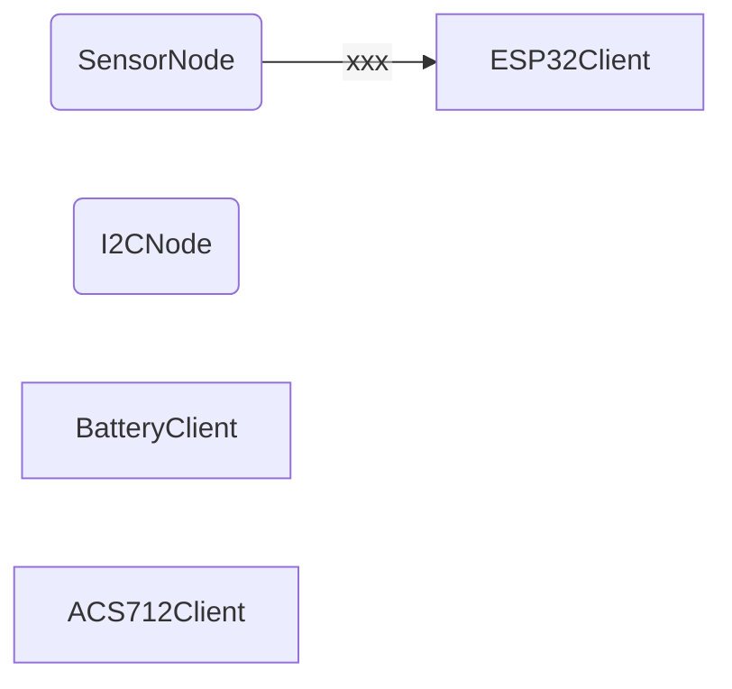

# Overview

```mermaid

---
config:
  flowchart:
    htmlLabels: false
---

graph LR;
    SensorN@{ shape: rounded, label: "SensorNode" }
    I2CN@{ shape: rounded, label: "I2CNode" }
    ESPClient@{ shape: rect, label: "ESP32Client" }
    BatClient@{ shape: rect, label: "BatteryClient" }
    ACSClient@{ shape: rect, label: "ACS712Client" }

    SensorN-->|xxx|ESPClient

```
