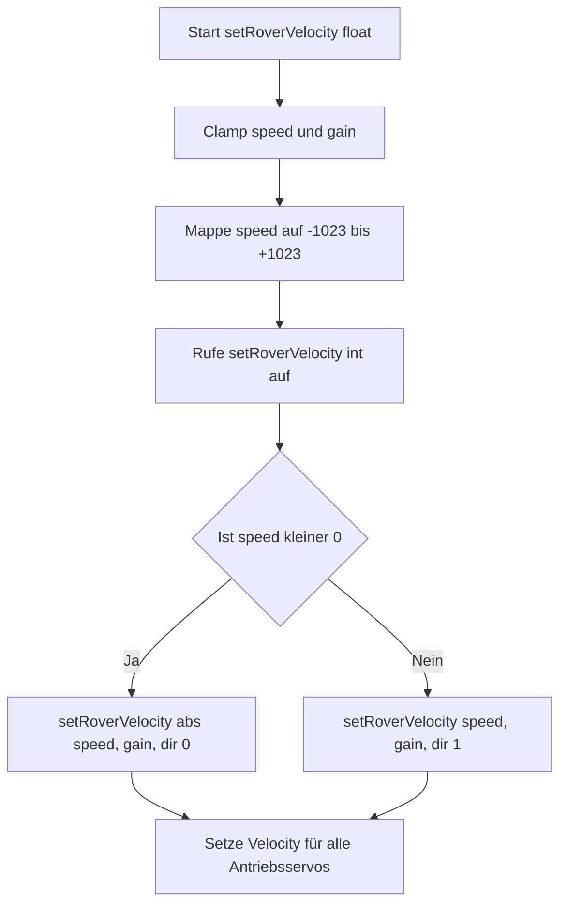
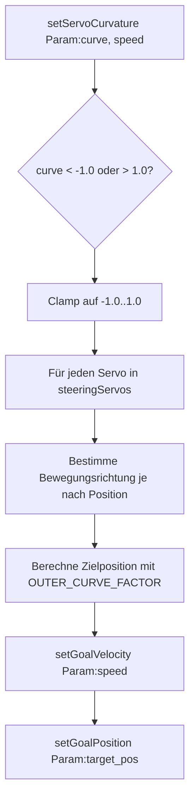
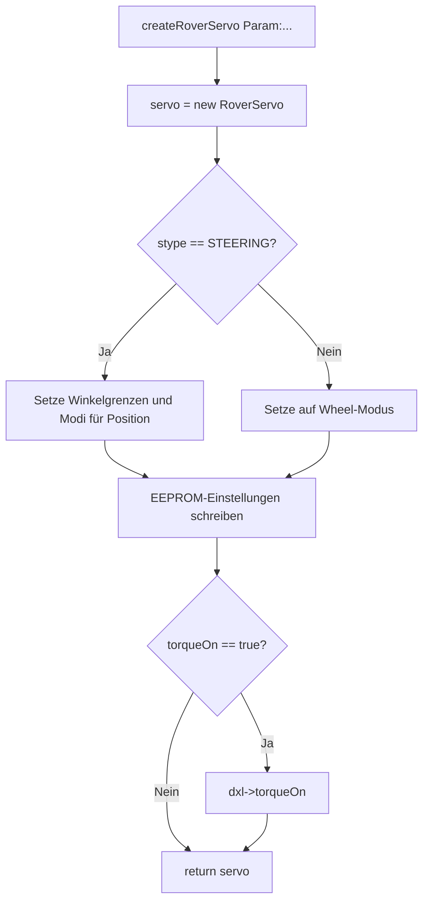

# Dokumentation: `rover_utils.h`

> Stand: 2025-05-04  
> Diese Datei enthält Hilfsfunktionen für die Steuerung von Dynamixel-Servos am ESP32.  
> Insbesondere werden Funktionen zur Konvertierung, Initialisierung und synchronisierten Ansteuerung bereitgestellt.

---

## Inhaltsverzeichnis

- [Dokumentation: `rover_utils.h`](#dokumentation-rover_utilsh)
  - [Inhaltsverzeichnis](#inhaltsverzeichnis)
  - [Makros \& Includes](#makros--includes)
  - [Hilfsfunktionen](#hilfsfunktionen)
    - [`id_exists`](#id_exists)
    - [`setAngle`](#setangle)
    - [`getPostionInDegree`](#getpostionindegree)
    - [`printCurrentAngles`](#printcurrentangles)
  - [Servo-Konfiguration \& Limits](#servo-konfiguration--limits)
    - [`saveAngleLimits`](#saveanglelimits)
    - [`setWheelMode`](#setwheelmode)
    - [`scanAllDynamixels`](#scanalldynamixels)
  - [Rover-Geschwindigkeit](#rover-geschwindigkeit)
    - [`setRoverVelocity(Dynamixel2Arduino*, uint16_t, float gain, uint8_t dir)`](#setrovervelocitydynamixel2arduino-uint16_t-float-gain-uint8_t-dir)
    - [`setRoverVelocity(Dynamixel2Arduino*, int speed, float gain)`](#setrovervelocitydynamixel2arduino-int-speed-float-gain)
    - [`setRoverVelocity(Dynamixel2Arduino*, float speed, float gain)`](#setrovervelocitydynamixel2arduino-float-speed-float-gain)
  - [Servo-Erzeugung \& Grundposition](#servo-erzeugung--grundposition)
    - [`createRoverServo`](#createroverservo)
    - [`setAllServosToStandardPosition`](#setallservostostandardposition)
  - [Steuerfunktionen für Lenkung](#steuerfunktionen-für-lenkung)
    - [`setAllSteeringServosToPosition`](#setallsteeringservostoposition)
    - [`setServoCurvature`](#setservocurvature)
    - [`setServosToSidway`](#setservostosidway)
  - [Lizenz \& Autor](#lizenz--autor)
  - [🧭 Ablaufdiagramme (Mermaid)](#-ablaufdiagramme-mermaid)
    - [1. setRoverVelocity (float)](#1-setrovervelocity-float)
    - [2. setServoCurvature](#2-setservocurvature)
    - [3. createRoverServo](#3-createroverservo)

---

## Makros & Includes

```cpp
#define ARRAY_SIZE(arr) (sizeof(arr) / sizeof((arr)[0]))
#define SPEED_MULTIPLIER 1000
```

```cpp
#include <Arduino.h>
#include <Dynamixel2Arduino.h>
#include "rover.h"
```

---

## Hilfsfunktionen

### `id_exists`

| Parameter | Typ | Beschreibung |
|----------|-----|--------------|
| `id` | `uint8_t` | Zu suchende ID |
| `array` | `const uint8_t*` | Zeiger auf Array |
| `size` | `uint8_t` | Länge des Arrays |

→ Prüft, ob eine Servo-ID im gegebenen Array vorhanden ist.

---

### `setAngle`

Stellt eine Zielposition für ein Servo ein, abhängig von übergebenem Wert und Einheit.

| Einheit | Beschreibung |
|--------|--------------|
| `UNIT_RAW` | Werte zwischen -1.0 bis 1.0 |
| `UNIT_PERCENT` | Werte zwischen -100.0 bis 100.0 |
| `UNIT_DEGREE` | Winkel 0–300° |

---

### `getPostionInDegree`

Liest den aktuellen Winkel eines Servos (0–300°) aus.

---

### `printCurrentAngles`

Gibt Winkel aller Lenkservos seriell aus (nicht aktiv im Code).

---

## Servo-Konfiguration & Limits

### `saveAngleLimits`

Speichert physikalische Limits eines Servos (EEPROM).

### `setWheelMode`

Setzt den Servo in den kontinuierlichen Drehrichtungsmodus ("Wheel Mode").

### `scanAllDynamixels`

Sendet Pings an alle IDs im Bereich 1–253. Gibt gefundene Servos mit Modellnummer aus.

---

## Rover-Geschwindigkeit

### `setRoverVelocity(Dynamixel2Arduino*, uint16_t, float gain, uint8_t dir)`

- Geschwindigkeit 0–1023
- Richtung (dir): 0 = rückwärts, 1 = vorwärts
- `gain`: -1.0 bis +1.0

### `setRoverVelocity(Dynamixel2Arduino*, int speed, float gain)`

- Geschwindigkeit: -1023 bis +1023
- Automatische Richtungserkennung

### `setRoverVelocity(Dynamixel2Arduino*, float speed, float gain)`

- Geschwindigkeit: -1.0 bis +1.0 (z. B. Gamepad-Achse)
- Intern umgerechnet in Servo-Werte

---

## Servo-Erzeugung & Grundposition

### `createRoverServo`

Erzeugt ein Servo-Objekt mit:

| Parameter | Bedeutung |
|----------|-----------|
| `stype` | `STEERING` oder `WHEEL` |
| `spos` | Position (`VL`, `VR`, `HL`, `HR`) |
| `cw_angle`, `ccw_angle` | Winkelgrenzen |
| `start_angle` | Geradeaus-Position |
| `fwd_velo`, `bck_velo` | Startwerte für Bewegung |
| `torqueOn` | Servo direkt aktivieren |

---

### `setAllServosToStandardPosition`

Setzt alle Lenkservos in Grundstellung:

| Modus | Beschreibung |
|-------|--------------|
| `REGULAR` | Geradeaus |
| `TURN` | Rotationsmodus (auf der Stelle drehen) |

---

## Steuerfunktionen für Lenkung

### `setAllSteeringServosToPosition`

Setzt Lenkung für Linkskurve, Rechtskurve oder Geradeaus über Positionen der inneren / äußeren Räder.

---

### `setServoCurvature`

Setzt Lenkung entsprechend eines Krümmungswerts zwischen -1.0 und +1.0 (Ackermann-Lenkung).

---

### `setServosToSidway`

Positioniert Servos so, dass der Rover seitwärts fahren kann (90°-Lenkung).

---

## Lizenz & Autor

- Für den internen Gebrauch mit Dynamixel AX-12A Servos
- Steuerung über ESP32 (Arduino-Framework)


---

## 🧭 Ablaufdiagramme (Mermaid)

### 1. setRoverVelocity (float)



---

### 2. setServoCurvature



---

### 3. createRoverServo


